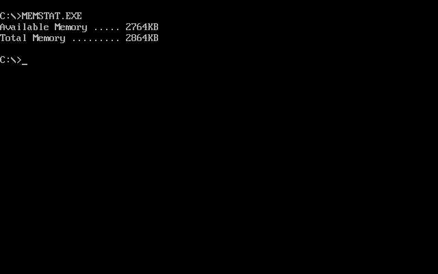

# Memory Status
A basic example about how to get available and total memory.

## What you learn
The goal of this example is to show how through DPMI function calls we can get information about the host managed memory. This example only uses a few DMPI functions but it's for the user to explore the rest from DJGPP docs [here](https://www.delorie.com/djgpp/doc/libc/libc_9.html)

<figure align="center">
    
    <figcaption>Memory Stats</figcapture>
</figure>