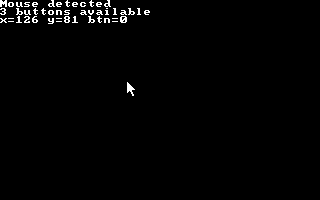

# Mouse Control
A very basic example about how to detect and read mouse coordinates.

## What you learn
The goal of this example is to show how to handle mouse input data by detecting mouse support, reading its coordinates, scaling them based on the screen resolution and show and hide system mouse pointer.

<figure align="center">
    
    <figcaption>Mouse coordinates</figcapture>
</figure>